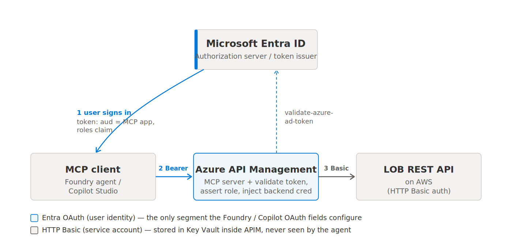

# Exposing a Line-of-Business API as MCP via Azure API Management

**Architecture Design &amp; Setup Guide**
_Secured with Microsoft Entra ID &middot; Consumed by Microsoft Foundry agents and Copilot Studio_

> **Version:** 0.2 (draft) &middot; **Status:** For review

---

## Contents

- [1. Purpose and scope](#1-purpose-and-scope)
- [2. Selected architecture and decisions](#2-selected-architecture-and-decisions)
- [3. Solution architecture](#3-solution-architecture)
- [4. Microsoft Entra identity design](#4-microsoft-entra-identity-design)
  - [4.1 Resource app registration (the MCP API)](#41-resource-app-registration-the-mcp-api)
  - [4.2 Client app registration (for the agent platforms)](#42-client-app-registration-for-the-agent-platforms)
  - [4.3 Group-to-role assignment](#43-group-to-role-assignment)
  - [4.4 Token flow](#44-token-flow)
- [5. Azure API Management design](#5-azure-api-management-design)
  - [5.1 The two MCP servers](#51-the-two-mcp-servers)
  - [5.2 Inbound authorization policy](#52-inbound-authorization-policy)
  - [5.3 Backend authentication (APIM → AWS)](#53-backend-authentication-apim--aws)
  - [5.4 Operational caveats for MCP servers](#54-operational-caveats-for-mcp-servers)
- [6. Consuming the MCP servers](#6-consuming-the-mcp-servers)
  - [6.1 Microsoft Foundry agent](#61-microsoft-foundry-agent)
  - [6.2 Microsoft Copilot Studio](#62-microsoft-copilot-studio)
- [7. Step-by-step setup guide](#7-step-by-step-setup-guide)
- [8. Security considerations](#8-security-considerations)
- [9. Validation and testing](#9-validation-and-testing)
- [10. Assumptions and open items](#10-assumptions-and-open-items)

---

## 1. Purpose and scope

This document describes a production architecture for exposing an existing line-of-business (LOB) REST API as Model Context Protocol (MCP) servers, so the API can be invoked as tools by Microsoft Foundry agents and Microsoft Copilot Studio agents. The LOB API is hosted on AWS, exposes a mix of read-only and read/write operations, and is secured to its own callers with HTTP Basic authentication.

The design uses Azure API Management (APIM) as the AI gateway. APIM natively exposes a managed REST API as a remote MCP server and applies policy at the gateway: it validates the caller's Microsoft Entra token, authorizes the call against an application role, and authenticates separately to the AWS backend. Access is split into a read-only MCP server and a read/write MCP server, each gated by Entra group membership.

**In scope:** Entra app registrations and app roles, group-to-role mapping, the two MCP servers in APIM, the inbound authorization and outbound backend-authentication policies, and the consumer-side configuration in Foundry and Copilot Studio.
**Out of scope:** changes to the LOB API itself, network connectivity between APIM and AWS, and APIM instance provisioning (assumed to exist on a tier that supports MCP servers).

---

## 2. Selected architecture and decisions

The following decisions were confirmed and drive the rest of this document.

| Decision area | Choice | Rationale |
|---|---|---|
| **Caller identity** | OAuth identity passthrough (delegated / OBO) | Agents always run interactively. Passthrough is the only model that carries the signed-in user's group membership to APIM, satisfying per-user read vs read/write access. |
| **Authorization model** | App roles assigned to Entra security groups | Yields a clean `roles` claim, avoids the group-overage problem, and uses readable role names instead of group GUIDs in policy. |
| **MCP surface** | Two MCP servers: read-only and read/write | Keeps tool surfaces clean and lets each server enforce a single required role. |
| **Backend auth (APIM → AWS)** | HTTP Basic, or API key in a query parameter / header | Matches whichever scheme the LOB team uses; the credential is held as a Key Vault-backed named value either way (see 5.3). |
| **Consumers** | Foundry agents + Copilot Studio | Both support manual OAuth configuration against an Entra-protected MCP server. |

---

## 3. Solution architecture

There are three independent trust boundaries. Conflating them is the most common source of confusion, so they are called out explicitly. The OAuth fields configured in Foundry or Copilot Studio govern only the first boundary; the backend credential is internal to APIM.



*Figure 1. Token flow and the three trust boundaries.*

### Trust boundaries

- **Boundary 1 &mdash; client to APIM (Entra OAuth).** The signed-in user authenticates to Entra; the agent presents the resulting access token (audience = the MCP server's app registration, with a `roles` claim) to APIM as a Bearer token.
- **Boundary 2 &mdash; token validation inside APIM.** APIM validates the token against Entra and asserts the required application role for the specific MCP server before forwarding anything.
- **Boundary 3 &mdash; APIM to AWS (Basic auth).** APIM authenticates to the LOB API with a service-account username and password, injected from Key Vault. The agent never sees these credentials.

> [!NOTE]
> APIM is **not** an OAuth authorization server. It does not host `/authorize` or `/token` endpoints; it only validates tokens issued by Entra. Every OAuth URL entered on the consumer side therefore points at the Entra tenant, not at APIM.

---

## 4. Microsoft Entra identity design

Two app registrations are used. This is the standard resource-server plus client pattern. The LOB application is **neither** of them &mdash; it is not represented in Entra at all, because its authentication is handled entirely by APIM at boundary 3.

**Two lists, two jobs.** A single app appears in two places in the Microsoft Entra admin center, and the controls live in different places. App roles and scopes are _defined_ under **App registrations**; users and groups are _assigned_ to those roles under **Enterprise applications** (the service principal for the same app). That split is the usual reason a control seems to be missing.

| Blade | What it is | What you do here |
|---|---|---|
| **App registrations** | The app definition (its manifest) | Create the app; define app roles and scopes; create client secrets; set redirect URIs and API permissions |
| **Enterprise applications** | The service principal &mdash; the app's instance in your tenant | Assign users and groups to app roles; set "Assignment required"; review consent |

### 4.1 Resource app registration (the MCP API)

Represents the APIM-published MCP endpoint and is the audience of the access token APIM validates. It has no redirect URI and no client secret &mdash; it is a resource, not a caller.

- **Application ID URI:** `api://lob-mcp` (example).
- **App roles:** `Mcp.Read` and `Mcp.ReadWrite`, allowed member types Users/Groups.
- **Exposed scope:** `api://lob-mcp/Mcp.Invoke` &mdash; establishes the audience; the read vs write decision is carried by the roles, not the scope.

**Portal steps** (Microsoft Entra admin center):

1. Go to **Entra ID → App registrations → New registration**. Name it e.g. `LOB MCP API`; Single tenant; leave Redirect URI blank; Register.
2. On **Overview**, copy the Application (client) ID and Directory (tenant) ID.
3. Open **Manage → Expose an API**. Next to Application ID URI select **Add**; change the suggested value to `api://lob-mcp`; Save.
4. Still on Expose an API, select **Add a scope**: name `Mcp.Invoke`; who can consent **Admins and users**; fill the consent display names; Enabled; Add scope.
5. Open **Manage → App roles → Create app role**, twice: (`MCP Read`, Users/Groups, value `Mcp.Read`) and (`MCP Read/Write`, Users/Groups, value `Mcp.ReadWrite`). The **Value** string is what appears in the `roles` claim and what APIM asserts; the display name is cosmetic.

### 4.2 Client app registration (for the agent platforms)

Drives the OAuth authorization-code flow on behalf of the user. Its client ID and secret are entered into the Foundry / Copilot Studio OAuth configuration.

**Portal steps:**

1. Open **App registrations → New registration**. Name it e.g. `LOB MCP Client`; Single tenant; leave Redirect URI blank for now; Register.
2. On **Overview**, copy the Application (client) ID &mdash; this is the **Client ID** in the Foundry / Copilot form.
3. Open **Manage → Certificates &amp; secrets → New client secret**. Copy the **Value** immediately (shown once) &mdash; this is the **Client secret** in the form.
4. Open **Manage → API permissions → Add a permission → My APIs**; select `LOB MCP API` → Delegated permissions → check `Mcp.Invoke` → Add permissions.
5. **Add a permission → Microsoft Graph → Delegated permissions**; add `offline_access` (enables refresh tokens).
6. Select **Grant admin consent** for your tenant so users are not individually prompted for the API.
7. **Redirect URIs (later):** when Foundry's Connect or the Copilot wizard returns a redirect URL, add it under **Manage → Authentication → Add a platform → Web**.

> [!TIP]
> If `LOB MCP API` does not appear under **My APIs**, set an owner on both apps (**Manage → Owners → Add owners**) and retry.

### 4.3 Group-to-role assignment

Assignment happens on the resource app's **enterprise application** &mdash; not its app registration. Two existing Entra security groups are mapped to the two app roles:

| Entra security group | App role assigned | Effective access |
|---|---|---|
| `LOB-MCP-ReadOnly` | `Mcp.Read` | Read-only MCP server only |
| `LOB-MCP-ReadWrite` | `Mcp.ReadWrite` | Read/write MCP server (and, if desired, read-only) |

**Portal steps:**

1. Go to **Entra ID → Enterprise applications → All applications**; open `LOB MCP API` (same name as the registration).
2. Open **Manage → Users and groups → Add user/group**.
3. Select the `LOB-MCP-ReadOnly` group; under **Select a role** choose `MCP Read`; Assign.
4. Add the `LOB-MCP-ReadWrite` group with role `MCP Read/Write`; Assign.

> [!NOTE]
> **Licensing:** group-based assignment requires Microsoft Entra ID P1 or P2. On the free tier you can assign only individual users, and nested-group memberships are not honored. To ensure only assigned users receive a token at all, set **Properties → Assignment required?** to **Yes** on the same enterprise app.

**Why app roles rather than raw group claims:** when a user belongs to more than roughly 200 groups, Entra omits the groups claim and emits an overage indicator, forcing a Microsoft Graph lookup at validation time. App roles assigned to groups surface as a stable `roles` claim with human-readable values, so APIM policy stays simple and fast.

### 4.4 Token flow

1. The user interacts with the agent and is prompted to sign in (first use generates a consent link).
2. Entra authenticates the user and issues an access token with `aud` = the resource app and a `roles` claim reflecting the user's group-derived role(s).
3. The agent presents the token to the APIM MCP endpoint as a Bearer token.
4. APIM validates the token and asserts the role required by that MCP server (`Mcp.Read` or `Mcp.ReadWrite`).
5. On success, APIM injects the backend Basic credential and forwards the call to the AWS LOB API.

> [!IMPORTANT]
> **Scopes vs roles &mdash; a common snag.** The Scopes field on the consumer side (Section 6) takes the delegated scope `Mcp.Invoke`, **not** an app role. App roles (`Mcp.Read` / `Mcp.ReadWrite`) **cannot** be requested through the scope parameter &mdash; they are assigned to groups and arrive automatically in the token's `roles` claim. So every consumer, read-only and read/write alike, sends the same scope value (`api://lob-mcp/Mcp.Invoke`); the `roles` claim, populated from the user's group membership, is what each MCP server checks to allow or deny the call. The scope gets the caller in the door (audience + consent); the role decides what they can do once inside.

> [!NOTE]
> **Verify before wiring APIM.** After a group member signs in, decode the access token (e.g., jwt.ms) and confirm the `roles` claim contains `Mcp.Read`/`Mcp.ReadWrite`, and that the `aud` claim matches what your APIM `<audience>` asserts. Depending on the resource app's accepted token version, `aud` is either `api://lob-mcp` or the resource app's client-ID GUID &mdash; pin the policy to whichever actually appears.

---

## 5. Azure API Management design

### 5.1 The two MCP servers

Import the LOB API into APIM (OpenAPI or manual operations), then create two MCP servers under **APIs → MCP Servers → Create MCP server → Expose an API as an MCP server**. Select operations as tools per server:

- **Read-only MCP server:** select only the safe read operations (typically GET).
- **Read/write MCP server:** select the operations that mutate state (plus reads if convenient).

Each MCP server has its own policy scope. APIM currently supports MCP *tools* (not resources or prompts) for servers exposed from managed REST APIs, and MCP servers are not supported in workspaces.

**Turn off the subscription gate.** On each MCP server's Settings tab, clear **Subscription required**. APIM's subscription-key check is independent of token validation; leaving it on would force callers to present both a subscription key and a bearer token, which Foundry and Copilot Studio do not do. Disabling it makes the validated Entra token the single access gate, as intended by this design.

### 5.2 Inbound authorization policy

Applied to each MCP server. It validates the Entra token, pins the audience to the resource app, and requires the role for that server. Example for the **read/write** MCP server (swap the role value to `Mcp.Read` on the read-only server):

```xml
<inbound>
  <base />
  <validate-azure-ad-token tenant-id="{{aad-tenant-id}}"
      header-name="Authorization"
      failed-validation-httpcode="401"
      failed-validation-error-message="Unauthorized.">
    <client-application-ids>
      <application-id>{{client-app-id}}</application-id>
    </client-application-ids>
    <audiences>
      <audience>api://lob-mcp</audience>
    </audiences>
    <required-claims>
      <claim name="roles" match="any">
        <value>Mcp.ReadWrite</value>
      </claim>
    </required-claims>
  </validate-azure-ad-token>
</inbound>
```

### 5.3 Backend authentication (APIM → AWS)

After APIM has validated the caller's token, it authenticates to the AWS LOB API on the outbound leg. Whatever the scheme, the secret is held as a Key Vault-backed named value so it never appears in policy text and rotates automatically. Create the named value once (below), then reference it from whichever policy your backend requires &mdash; Option A or Option B.

**Create the Key Vault-backed named value:**

1. Ensure the APIM instance has a managed identity: APIM → **Security → Managed identities**, set System assigned to On (or attach a user-assigned identity).
2. Grant that identity Get and List secret permissions on the Key Vault. In the vault → **Access configuration**, check the permission model: for **Access policies**, add a policy with Secret permissions `Get` + `List` for the APIM identity; for **Azure RBAC**, assign the `Key Vault Secrets User` role to the APIM identity. (If access isn't set up, APIM offers to configure it for you in the next step.)
3. In APIM → **Named values → + Add**: enter a Name and Display name (e.g. `lob-api-key`); set Type to **Key vault**; enter or Select the secret identifier _without_ a version; choose the client identity (the system-assigned identity); Save, then Create.
4. Reference it in policy as `{{lob-api-key}}`.

> [!NOTE]
> Omit the secret version in the identifier so APIM auto-rotates the value (it refreshes within ~4 hours of a Key Vault update). Repeat for each secret a scheme needs.

#### 5.3.1 Option A &mdash; HTTP Basic (username / password)

Inject Basic credentials outbound. Create two named values (e.g. `lob-api-username` and `lob-api-password`) and reference them:

```xml
<backend>
  <base />
  <authentication-basic username="{{lob-api-username}}"
                        password="{{lob-api-password}}" />
</backend>
```

The `authentication-basic` policy sets the Authorization header to the Base64 of `user:password` for the backend call.

#### 5.3.2 Option B &mdash; API key in a query parameter or header

If the backend expects a static API key, inject it _inbound_ so it becomes part of the request APIM forwards. Use one named value (e.g. `lob-api-key`). For a query-string key:

```xml
<inbound>
  <base />
  <set-query-parameter name="code" exists-action="override">
    <value>{{lob-api-key}}</value>
  </set-query-parameter>
</inbound>
```

For a header-based key, swap to `set-header` with the same structure:

```xml
<inbound>
  <base />
  <set-header name="x-api-key" exists-action="override">
    <value>{{lob-api-key}}</value>
  </set-header>
</inbound>
```

- **Match the name exactly** to what the backend expects (`code`, `apikey`, `x-api-key`, etc.).
- **Use** `exists-action="override"` so a caller cannot smuggle in their own value; APIM's value always wins.
- **Added at the gateway:** the key is appended server-side, so the MCP client never sees it.

### 5.4 Operational caveats for MCP servers

- Do not read `context.Response.Body` in MCP server policies &mdash; it forces response buffering and breaks the streaming the MCP protocol requires.
- If Application Insights / Azure Monitor diagnostic logging is enabled at the global (all-APIs) scope, set the Frontend Response payload-bytes-to-log to `0` to avoid interfering with MCP servers; log payloads selectively per API instead.
- External MCP clients must support MCP version `2025-06-18` or later when connecting to APIM-governed servers; this is relevant if you later front existing external MCP servers as well.

---

## 6. Consuming the MCP servers

### 6.1 Microsoft Foundry agent

In the agent's Playground, expand **Tools → Add → Model Context Protocol (MCP) → Create**, and configure an Entra-based connection using **OAuth Identity Passthrough**. Field mapping:

| Field | Value |
|---|---|
| Name | A unique label, e.g. `lob-mcp-readwrite` |
| Remote MCP Server endpoint | The APIM MCP server URL (`.../<mcp-server>/mcp` or `/sse`) |
| Authentication | OAuth Identity Passthrough |
| Client ID / Client secret | From the client app registration (Section 4.2) |
| Auth URL | `https://login.microsoftonline.com/{tenant}/oauth2/v2.0/authorize` |
| Token URL / Refresh URL | `https://login.microsoftonline.com/{tenant}/oauth2/v2.0/token` |
| Scopes | `api://lob-mcp/Mcp.Invoke offline_access` |

Select **Connect**; Foundry returns a redirect URL &mdash; add it to the client app registration's Redirect URIs, then Save the tool on the agent. On first use the agent prompts the user to sign in and consent, then calls the server with the user's token. Repeat for the read-only MCP server as a second tool. Users need at least the Foundry User role on the project, and their Entra tenant must match the project's tenant (cross-tenant passthrough is not supported).

### 6.2 Microsoft Copilot Studio

In the agent, open **Tools → Add a tool → Model Context Protocol**. In the wizard's Authentication section choose **OAuth 2.0 → Manual**, then Create. Copy the generated Redirect URL into the client app registration. Provide the same Entra authorization/token endpoints, the client ID and secret, and the resource scope. Copilot Studio registers a matching custom connector (visible under Custom connectors in the Power Platform portal); if your server advertises OAuth dynamic client registration, the wizard's **Dynamic discovery** option can configure this automatically instead of manual entry.

---

## 7. Step-by-step setup guide

End-to-end order of operations. Steps 1&ndash;7 are one-time platform setup; 8&ndash;10 are per-consumer.

1. Register the resource app (`api://lob-mcp`). Define app roles `Mcp.Read` and `Mcp.ReadWrite`; publish the delegated scope under *Expose an API*.
2. Register the client app. Grant delegated permission to the resource scope plus `offline_access`; create a client secret.
3. On the resource app's enterprise application, assign `LOB-MCP-ReadOnly` → `Mcp.Read` and `LOB-MCP-ReadWrite` → `Mcp.ReadWrite`.
4. In Key Vault, store the LOB service-account username and password; create matching named values in APIM.
5. Import the LOB API into APIM. Create two MCP servers (read-only and read/write) selecting the appropriate operations as tools.
6. On each MCP server's Settings tab, clear **Subscription required** so the validated Entra token is the only access gate.
7. Apply the inbound `validate-azure-ad-token` policy (with the correct required role per server) and the backend `authentication-basic` policy to each MCP server.
8. In Foundry, add each MCP server as an MCP tool using OAuth identity passthrough; copy the redirect URL back into the client app registration.
9. In Copilot Studio, add each MCP server via the MCP wizard (OAuth 2.0 → Manual); copy its redirect URL into the client app registration.
10. Validate end to end (Section 9), including negative tests for role enforcement.

---

## 8. Security considerations

- **Least privilege at the backend.** The Basic service account should hold only the permissions the exposed operations need; the read-only server should ideally map to a read-only backend identity if the LOB team can provide one.
- **Audience pinning.** Always assert the audience (`api://lob-mcp`) in policy so tokens minted for other resources cannot be replayed against the MCP endpoint.
- **Secret hygiene.** Keep the LOB credential and the client secret in Key Vault; rotate on a schedule. Prefer certificate credentials for the client app where policy allows.
- **Separate roles, separate servers.** Because each MCP server requires a distinct role, a read-only user presenting a valid token is still rejected by the read/write server at boundary 2.
- **Tenant boundary.** OAuth identity passthrough requires the user and the Foundry project to share a tenant; plan accordingly for any external collaborators.
- **Tool approval.** Consider requiring per-call approval on write tools in the agent configuration for an added human checkpoint on mutations.

---

## 9. Validation and testing

- **Plumbing first (optional).** Before enabling OAuth, you can smoke-test each MCP server with a built-in subscription key (header `Ocp-Apim-Subscription-Key`) to confirm tool discovery and backend connectivity in isolation. This is a convenience only &mdash; the subscription key is not part of the production access model, and **Subscription required** should be off on the MCP servers (see 5.1).
- **Token validation.** Use an MCP inspector or the Foundry playground to confirm sign-in, consent, and tool invocation under the user's identity.
- **Positive tests.** A `LOB-MCP-ReadWrite` member can invoke write tools on the read/write server; a `LOB-MCP-ReadOnly` member can invoke read tools on the read-only server.
- **Negative tests.** A read-only user is rejected (401/403) by the read/write server; a token with no role is rejected by both.
- **Refresh.** Confirm long sessions survive token expiry (validates that `offline_access` is present and refresh works).

---

## 10. Assumptions and open items

- The APIM instance is on a tier that supports MCP servers and has network reachability to the AWS-hosted LOB API.
- The LOB API accepts a single shared service account over HTTP Basic; if it instead issues its own session token from a login endpoint, boundary 3 changes to a token-exchange step in policy (not required for the confirmed Basic-header case).
- Foundry OAuth identity passthrough has had model-specific rough edges reported in the playground; prototype the passthrough path early against the model(s) the agents will use.
- Group names (`LOB-MCP-ReadOnly` / `LOB-MCP-ReadWrite`) and the `api://lob-mcp` identifier are placeholders to be finalized with the platform team.

---

_End of document &mdash; draft for review._
